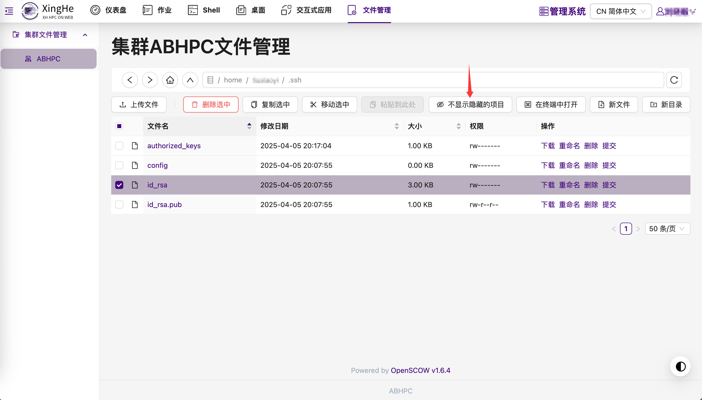
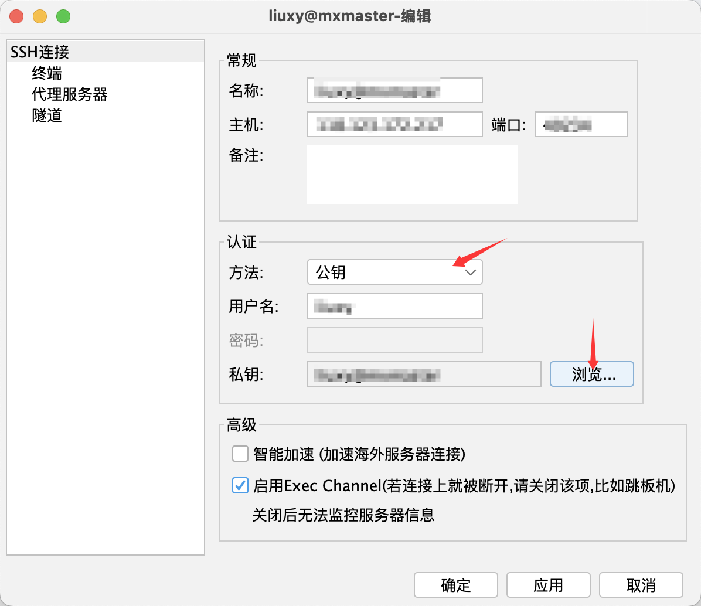
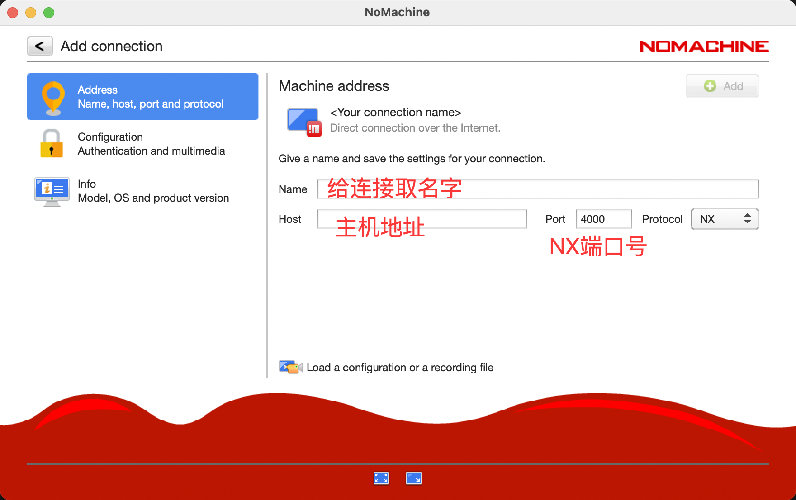
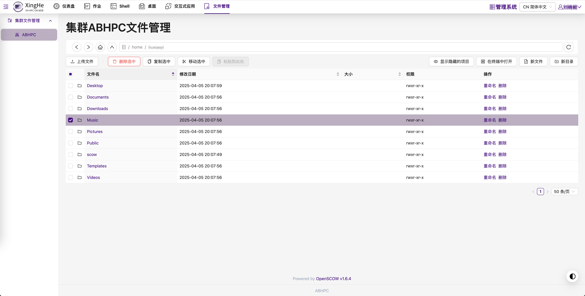
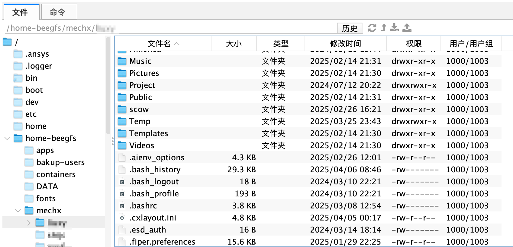
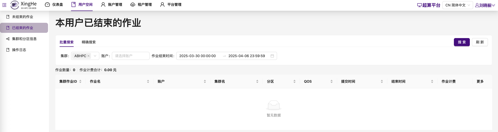

# SCOW User Manual Based on ABHPC System <!-- omit in toc -->

[简体中文](README.md)|[English](README.en.md)

This tutorial is applicable to the supercomputing platform with SCOW configured on the ABHPC operating system. The main content includes the [User Manual](#1-user-manual) and the [Administrator Manual](#2-administrator-manual).

## Table of Contents <!-- omit in toc -->
- [1 User Initialization](#1-user-initialization)
  - [1.1 Switching Between Supercomputing Platform and Management System Interface](#11-switching-between-supercomputing-platform-and-management-system-interface)
  - [1.2 File System Initialization](#12-file-system-initialization)
  - [1.3 Change Password](#13-change-password)
- [2 Login Methods](#2-login-methods)
  - [2.1 Web Login](#21-web-login)
  - [2.2 SSH Login](#22-ssh-login)
  - [2.3 NX Login](#23-nx-login)
- [3 Data Upload and Download](#3-data-upload-and-download)
  - [3.1 Web File Management (Suitable for Viewing Files Online)](#31-web-file-management-suitable-for-viewing-files-online)
  - [3.2 SFTP Client File Transfer (Suitable for Batch File Transfers)](#32-sftp-client-file-transfer-suitable-for-batch-file-transfers)
- [4 Command Line Jobs](#4-command-line-jobs)
  - [4.1 Copy Script Template with slmscript](#41-copy-script-template-with-slmscript)
  - [4.2 Submit Job](#42-submit-job)
  - [4.3 View Jobs](#43-view-jobs)
  - [4.4 Cancel Job](#44-cancel-job)
- [5 Graphical Jobs](#5-graphical-jobs)
- [6 Billing Query](#6-billing-query)


## 1 User Initialization

### 1.1 Switching Between Supercomputing Platform and Management System Interface

Users can switch between two interfaces: the Supercomputing Platform and the Management System. The Supercomputing Platform is used for all job operations, while the Management System is for managing user passwords, expenses, and permissions. All users have the same supercomputing interface, but the Management System interface varies based on user roles (regular users, tenant administrators, platform administrators, and financial staff).

After logging into the system, check the **top right corner** for the interface switch icon. If it shows ``Admin``, you are currently on the **Supercomputing Platform**. Click ``Admin`` to switch to the **Management System** interface, and vice versa:

<div align="center">

</div>

Unless otherwise specified, the following user operations are performed on the **Supercomputing Platform** interface.

### 1.2 File System Initialization

Click ``Desktop -> Create New Desktop``, select the ``MATE`` desktop, choose the login node, and click OK to complete user initialization.

<div align="center">

</div>

**Note for Rocky Linux 8:** Since Rocky Linux 8.10 does not come with a default MATE desktop, users need to open a file browser, select ``Edit -> Preferences -> Extensions``, check ``Open terminal``, click ``Configure Extension``, and change ``mate-terminal`` to ``xfce4-terminal`` (as shown below). Otherwise, opening a terminal in a folder will not follow the current directory and will always open the ``$HOME`` directory.

<div align="center">

</div>

### 1.3 Change Password

In the **System Management** interface, click the username in the top right corner, then click on `Personal Information` (as shown below) to change the user's password and email:

<div align="center">

</div>

## 2 Login Methods

The ABHPC system currently offers three login methods: Web, SSH, and NX.

### 2.1 Web Login

Open the cluster SCOW address in a browser, enter your username and password to log in.

### 2.2 SSH Login

For SSH, it is recommended to use a client. A cross-platform recommendation is [FinalShell](https://www.hostbuf.com) (premium version only $5), which includes SSH and SFTP functionality. ABHPC uses RSA key login. First, download the private key locally, open the file management system, enable ``Show Hidden Items``, then open the ``.ssh`` folder and download the ``id_rsa`` file (<font color=red>**Note: This file is very important, please keep it safe**</font>):

<div align="center">

</div>

In FinalShell, create a new connection and import the downloaded ``id_rsa`` file:

<div align="center">

</div>

**Tip:** If you have private keys for multiple hosts, it is best to name them ``<username>@<hostname>.id_rsa`` to avoid confusion.

### 2.3 NX Login

ABHPC provides a Docker-based NX remote desktop, which can be connected using the Nomachine client. Each user has a unique NX port number, which must be obtained from the administrator beforehand.

Nomachine client [download link](https://downloads.nomachine.com/download-enterprise/#NoMachine-Enterprise-Client).

After creating a new connection, enter the connection name, host address, and port number to log in:

<div align="center">

</div>

## 3 Data Upload and Download

### 3.1 Web File Management (Suitable for Viewing Files Online)

<font color=red>**Note:** Due to web protocol limitations, you can only download single files and cannot download folders. This method is suitable for viewing files online, not for batch downloads.</font>

In the user interface, click “File Management” in the tab bar to open the user's home directory, where you can upload, download, delete, move, and copy files.

<div align="center">

</div>

### 3.2 SFTP Client File Transfer (Suitable for Batch File Transfers)

After logging in with FinalShell, you can use the SFTP at the bottom for uploading and downloading files and folders:

<div align="center">

</div>

## 4 Command Line Jobs

### 4.1 Copy Script Template with slmscript
For detailed usage of ```slmscript```, see [slmscript command](https://github.com/abhpc/slmscript):
```bash
slmscript cp <job.slm>
```

### 4.2 Submit Job
```bash
sbatch <job.slm>
```

### 4.3 View Jobs
```bash
squeue
```

### 4.4 Cancel Job
```bash
scancel <job id>
```

## 5 Graphical Jobs

After logging into the web page, open ```Interactive Jobs -> Create Application```, select the required application, set the resources, and submit the job:

<div align="center">

</div>

## 6 Billing Query

On the **Management System** homepage, you can view your account balance and unfinished job information:

<div align="center">

</div>

Go to ```User Space -> Completed Jobs``` to view your job bill (billing is completed only after the job ends):

<div align="center">

</div>