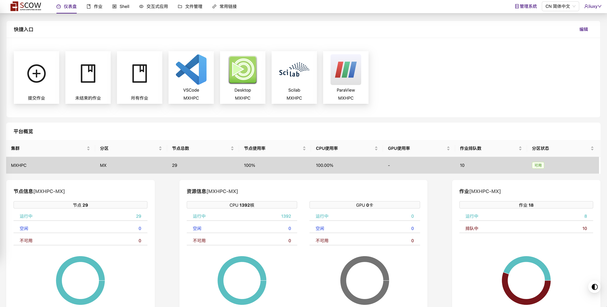

# SCOW User Manual Based on ABHPC System <!-- omit in toc -->

[简体中文](README.md)|[English](README.en.md)

This tutorial is applicable to the supercomputing platform with SCOW configured on the ABHPC operating system. The main content includes the [User Manual](#1-user-manual) and the [Administrator Manual](#2-administrator-manual).

## Table of Contents <!-- omit in toc -->
- [1 User Manual](#1-user-manual)
  - [1.1 Basic Interface: User Interface and Management System Interface](#11-basic-interface-user-interface-and-management-system-interface)
  - [1.2 Data Transfer](#12-data-transfer)
    - [1.2.1 Web File Transfer](#121-web-file-transfer)
    - [1.2.2 SFTP File Transfer](#122-sftp-file-transfer)
  - [1.3 Shell Job Management](#13-shell-job-management)
    - [1.3.1 Submitting Jobs](#131-submitting-jobs)
    - [1.3.2](#132)
  - [1.4 Web Job Management](#14-web-job-management)
  - [1.5 Graphical Pre and Post-processing](#15-graphical-pre-and-post-processing)
  - [1.6 Billing Inquiry](#16-billing-inquiry)
  - [1.7 Advanced Features](#17-advanced-features)
- [2 Administrator Manual](#2-administrator-manual)
  - [2.1 Creating Users](#21-creating-users)
  - [2.2 Deleting Users](#22-deleting-users)

## 1 User Manual

### 1.1 Basic Interface: User Interface and Management System Interface
Open the portal website in the browser address bar and enter the username and password to log in:

    

After logging in, pay attention to the panel switch icon in the **upper right corner**, if it displays "Management System", it means that you are currently in the **User Interface**, click "Management System" to enter the **Management System Interface**:

    

If it displays "SCOW HPC", it means that you are currently in the **Management System Interface**, click "SCOW HPC" to switch to the **User Interface**:

    

**Note**: The supercomputing interface is the same for all users, but the Management System Interface may vary for users with different permissions (regular users, tenant administrators, platform administrators, financial personnel).

### 1.2 Data Transfer

#### 1.2.1 Web File Transfer
Click "File Management" in the tab bar of the User Interface to open the user's home directory, where you can upload, download, delete, move, copy, and perform other operations on files.

    

**Note**: Due to the limitations of the web protocol, when downloading files, only individual files can be downloaded, and folders cannot be downloaded.

#### 1.2.2 SFTP File Transfer

### 1.3 Shell Job Management

#### 1.3.1 Submitting Jobs
#### 1.3.2 

### 1.4 Web Job Management

### 1.5 Graphical Pre and Post-processing

### 1.6 Billing Inquiry
As shown in the following figure, the dashboard has two workspaces: Quick Entry and Platform Overview:

    

### 1.7 Advanced Features

## 2 Administrator Manual
### 2.1 Creating Users

### 2.2 Deleting Users