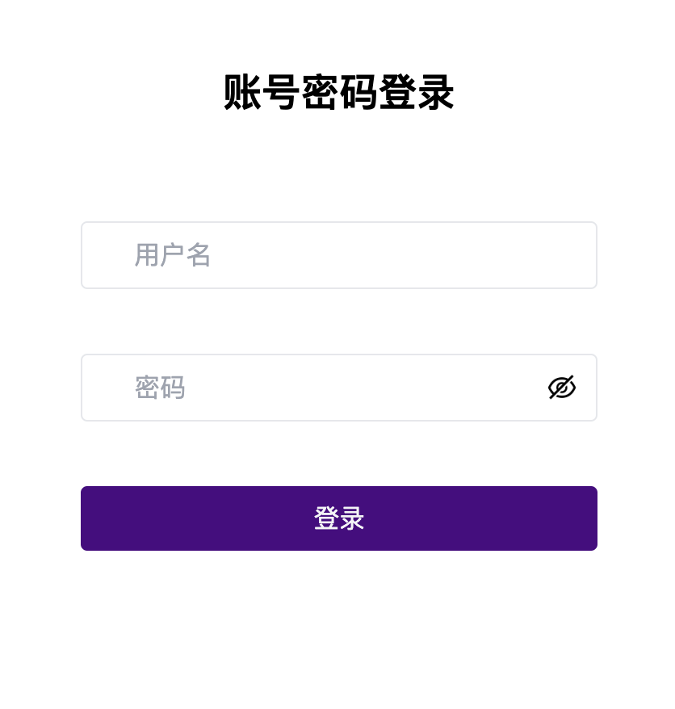

# 基于ABHPC系统的SCOW用户手册 <!-- omit in toc -->

本教程适用于在ABHPC操作系统上配置了SCOW的超算平台，主要内容为[用户手册](#1-用户手册) 

## 目录 <!-- omit in toc -->
- [1 用户手册](#1-用户手册)
  - [1.1 用户登录集群](#11-用户登录集群)
- [2 管理员手册](#2-管理员手册)
  - [2.1 创建用户](#21-创建用户)
  - [2.2 删除用户](#22-删除用户)

## 1 用户手册

### 1.1 用户登录集群

在浏览器中打开

    

## 2 管理员手册
### 2.1 创建用户

### 2.2 删除用户