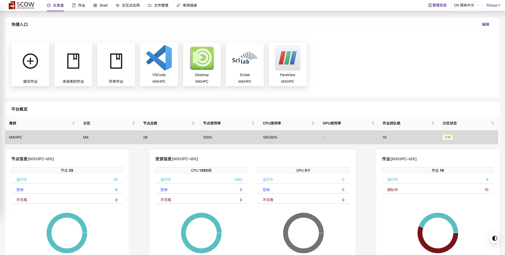

# 基于ABHPC系统的SCOW用户手册 <!-- omit in toc -->

[简体中文](README.md)|[English](README.en.md)

本教程适用于在ABHPC操作系统上配置了SCOW的超算平台用户，管理员另见[管理员手册](ADMIN.md)。

## 目录 <!-- omit in toc -->

- [1 用户初始化](#1-用户初始化)
  - [1.1 超算平台和管理系统界面切换](#11-超算平台和管理系统界面切换)
  - [1.2 文件系统初始化](#12-文件系统初始化)
  - [1.3 修改密码](#13-修改密码)
- [2 登录方式](#2-登录方式)
  - [2.1 Web登录](#21-web登录)
  - [2.2 SSH登录](#22-ssh登录)
  - [2.3 NX登录](#23-nx登录)
  - [1.4 数据上传与下载](#14-数据上传与下载)
    - [1.4.1 Web文件管理(适合在线查看文件)](#141-web文件管理适合在线查看文件)
    - [1.4.2 sftp客户端文件传输(适合批量传输文件)](#142-sftp客户端文件传输适合批量传输文件)
  - [1.3 Shell作业管理](#13-shell作业管理)
    - [1.3.1 提交作业](#131-提交作业)
    - [1.3.2](#132)
  - [1.4 Web作业管理](#14-web作业管理)
  - [1.5 图形化前后处理](#15-图形化前后处理)
  - [1.6 账单查询](#16-账单查询)
  - [1.7 进阶功能](#17-进阶功能)

## 1 用户初始化

### 1.1 超算平台和管理系统界面切换

用户有两个界面可切换：超算平台和管理系统。其中超算平台界面是用户的全部作业操作，而管理系统是用户管理自己的密码、费用和权限等操作。所有用户的超算界面相同，但不同权限的用户（普通用户、租户管理员、平台管理员、财务人员）的管理系统界面内容有差异。

用户登录进系统后，注意看**右上角**的面板切换图标，如果显示 ``管理系统``，则说明现在处于**超算平台**，点击 ``管理系统``可以进入**管理系统**界面，反之点击该按钮也可实现界面切换：

  

如无特别强调，下述用户操作都是在**超算平台**界面上。

### 1.2 文件系统初始化

点击 ``桌面——>新建桌面``，然后选择 ``MATE``桌面，选择登录节点后，点确定按钮，即可完成用户初始化。

  

**Rocky Linux 8系统注意事项：** 由于Rocky Linux 8.10默认无MATE桌面，因此用户需要打开一个文件浏览器，然后选择 ``Edit——>Preferences——>Extensions``，然后选中 ``Open terminal``，点击 ``Configure Extension``按钮，将原来的 ``mate-terminal``修改为 ``xfce4-terminal``(如下图所示)。否则在文件夹中打开终端不会跟随当前目录，永远是打开 ``$HOME``目录。

  

### 1.3 修改密码

在**系统管理**界面，点击右上角的用户名，然后点击个人信息(如下图所示)，可以修改用户的密码和邮箱：

  

## 2 登录方式

目前ABHPC系统提供三种登录方式：Web、SSH和NX。

### 2.1 Web登录

在浏览器中打开集群SCOW地址，输入用户名和密码登录即可。

### 2.2 SSH登录

SSH推荐使用客户端登录，跨平台的推荐[FinalShell](https://www.hostbuf.com)(付费高级版仅35元)，包含了ssh和sftp功能。ABHPC全系采用RSA密钥登录，首先下载私钥到本地，在文件管理系统打开 ``显示隐藏的项目``，然后打开 ``.ssh``文件夹，下载文件 ``id_rsa``（``**注意：该文件非常重要，请妥善保管**``）：

  

在Finalshell中新建连接，导入下载的 ``id_rsa``文件即可：

  

**小建议：** 如果你有多个主机的私钥，保管的时候，最好命名为 ``<username>@<hostname>.id_rsa``以免混淆。

### 2.3 NX登录

### 1.4 数据上传与下载

#### 1.4.1 Web文件管理(适合在线查看文件)

``**注意：** 由于web协议的限制，下载文件时，只能下载单个文件，且无法下载文件夹，该方法适合在线看文件，不适合批量下载文件。``

在用户界面的标签栏中点击“文件管理”，即可打开用户主目录，可进行文件的上传、下载、删除、移动、复制等操作。

  

#### 1.4.2 sftp客户端文件传输(适合批量传输文件)

### 1.3 Shell作业管理

#### 1.3.1 提交作业

#### 1.3.2

### 1.4 Web作业管理

### 1.5 图形化前后处理

### 1.6 账单查询

如下图所示，仪表盘有两个工作区：快捷入口和平台概览:

  

### 1.7 进阶功能
