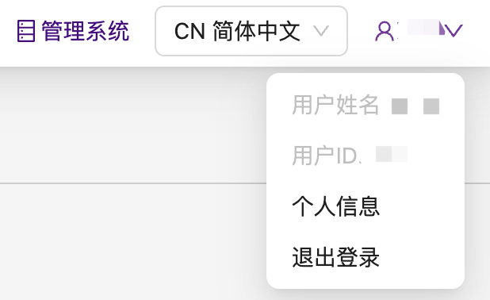
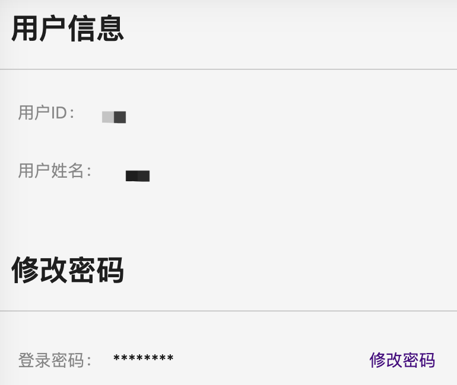

# 基于ABHPC系统的SCOW用户手册 <!-- omit in toc -->

[简体中文](README.md)|[English](README.en.md)

本教程适用于在ABHPC操作系统上配置了SCOW的超算平台，主要内容为[用户手册](#1-用户手册)和[管理员手册](#2-管理员手册)。 

## 目录 <!-- omit in toc -->
- [1 用户手册](#1-用户手册)
  - [1.1 基本功能](#11-基本功能)
    - [1.1.1 用户界面](#111-用户界面)
    - [1.1.2 修改密码](#112-修改密码)
  - [1.2 数据传输](#12-数据传输)
    - [1.2.1 web文件传输](#121-web文件传输)
    - [1.2.2 sftp文件传输](#122-sftp文件传输)
  - [1.3 Shell作业管理](#13-shell作业管理)
    - [1.3.1 提交作业](#131-提交作业)
    - [1.3.2](#132)
  - [1.4 Web作业管理](#14-web作业管理)
  - [1.5 图形化前后处理](#15-图形化前后处理)
  - [1.6 账单查询](#16-账单查询)
  - [1.7 进阶功能](#17-进阶功能)
- [2 管理员手册](#2-管理员手册)
  - [2.1 创建用户](#21-创建用户)
  - [2.2 删除用户](#22-删除用户)


## 1 用户手册

### 1.1 基本功能

#### 1.1.1 用户界面
在浏览器地址栏中打开门户网站，输入用户名和密码登录：
<div  align="center">    

</div>

用户登录进系统后，注意看<u>**右上角**</u>的面板切换图标，如果显示```管理系统```，则说明现在处于**用户界面**，点击```管理系统```可以进入**管理系统**界面：
<div  align="center">    

</div>

如果显示```SCOW HPC```，则说明现在处于**管理系统**界面，点击```SCOW HPC```可切换到**用户界面**：
<div  align="center">    

</div>

**注意**：所有用户的超算界面相同，但不同权限的用户（普通用户、租户管理员、平台管理员、财务人员）的管理系统界面有所差异。

#### 1.1.2 修改密码

点击右上角的用户账户，然后选择```个人信息```：
<div  align="center">    

</div>

进入修改个人信息页面，选择```修改密码```即可：
<div  align="center">    

</div>


### 1.2 数据传输

#### 1.2.1 web文件传输
在用户界面的标签栏中点击“文件管理”，即可打开用户主目录，可进行文件的上传、下载、删除、移动、复制等操作。
<div  align="center">    

</div>

**注意**:由于web协议的限制，下载文件时，只能下载单个文件，且无法下载文件夹。

#### 1.2.2 sftp文件传输


### 1.3 Shell作业管理

#### 1.3.1 提交作业
#### 1.3.2 

### 1.4 Web作业管理

### 1.5 图形化前后处理

### 1.6 账单查询
如下图所示，仪表盘有两个工作区：快捷入口和平台概览:
<div  align="center">    

</div>

### 1.7 进阶功能


## 2 管理员手册
### 2.1 创建用户


### 2.2 删除用户